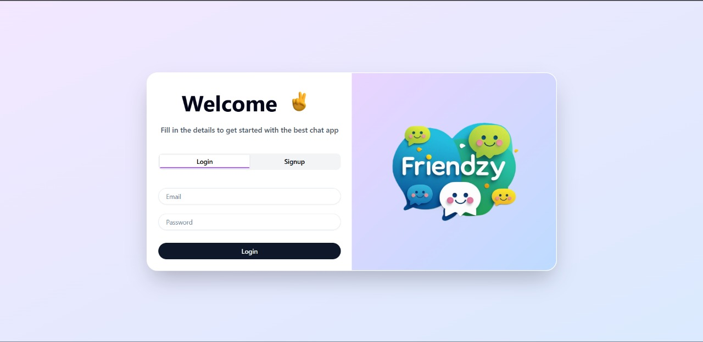
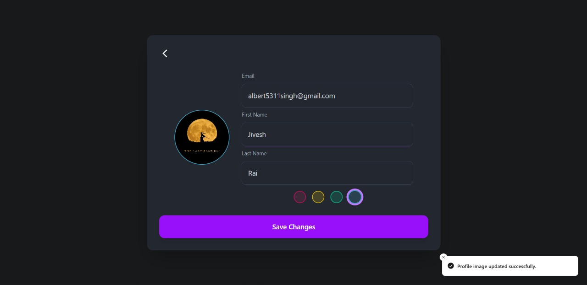
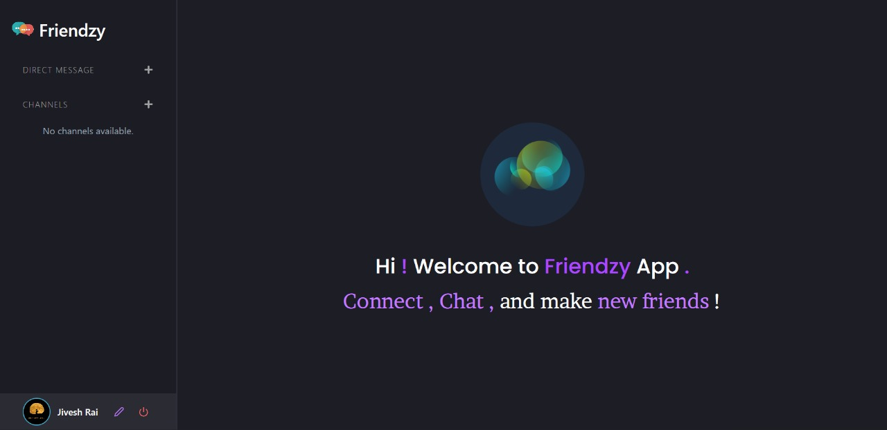
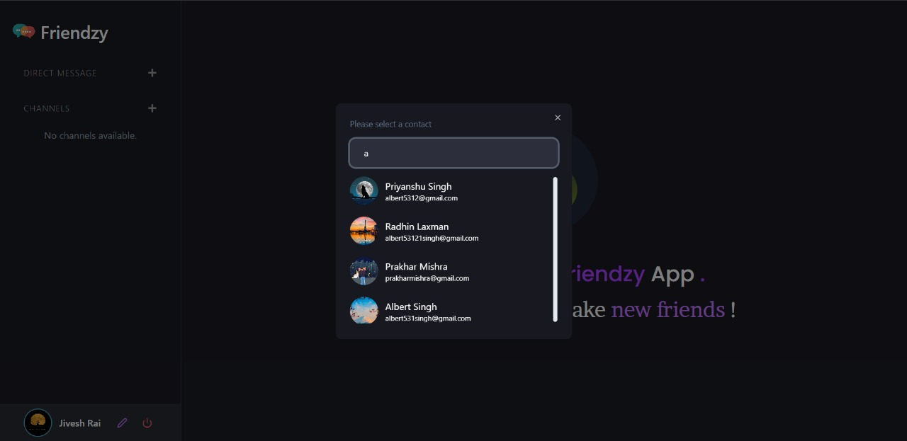
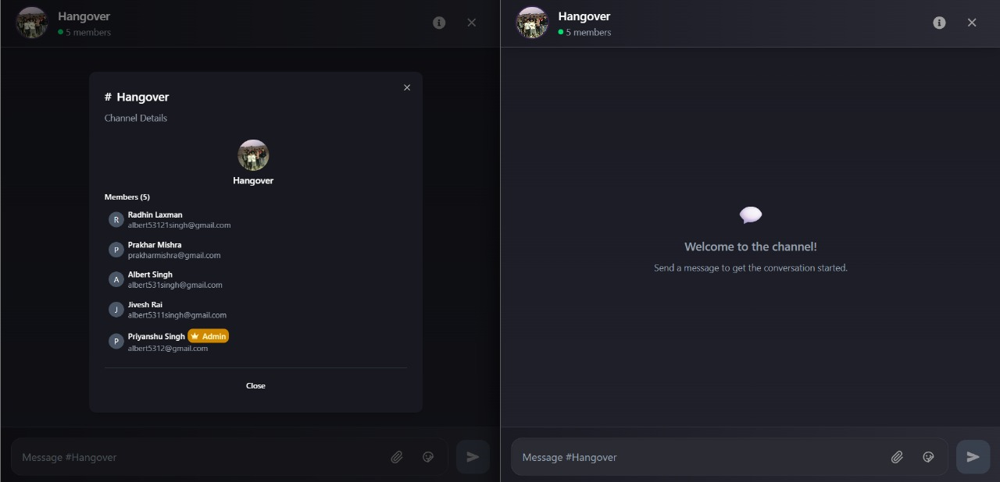
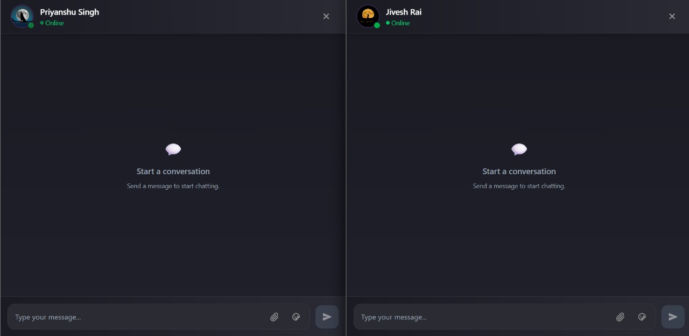
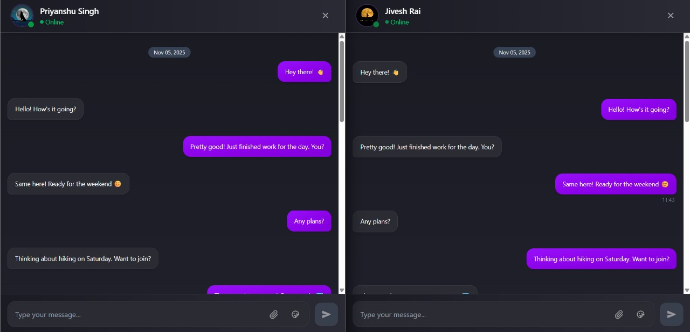
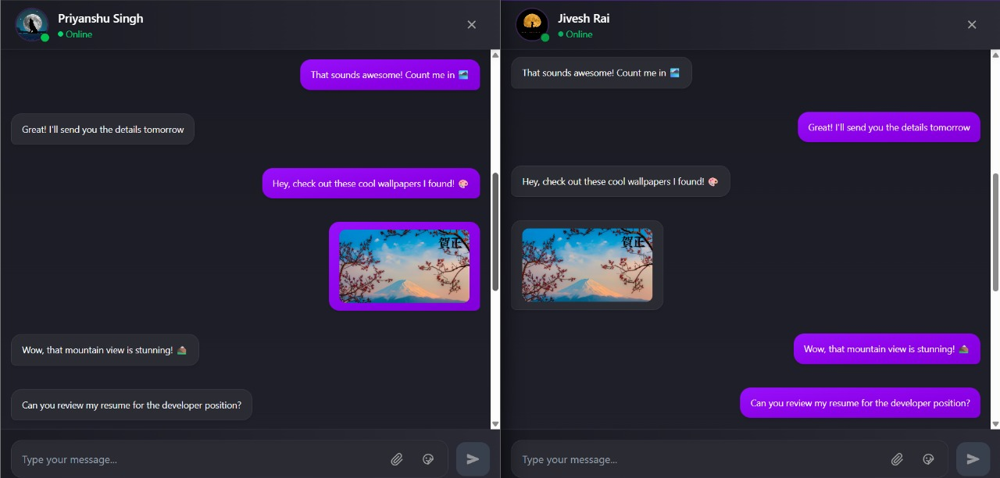
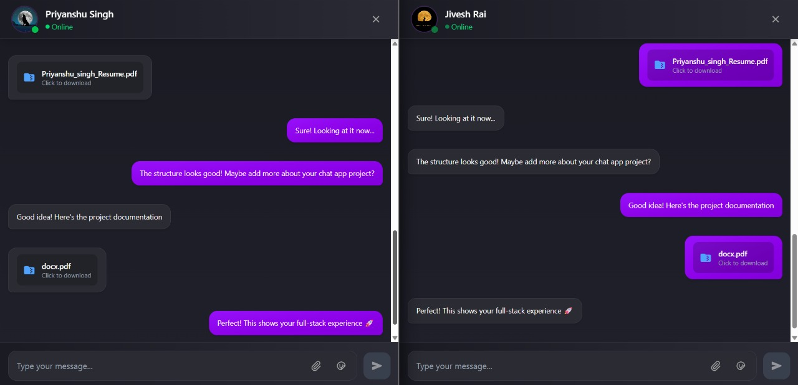
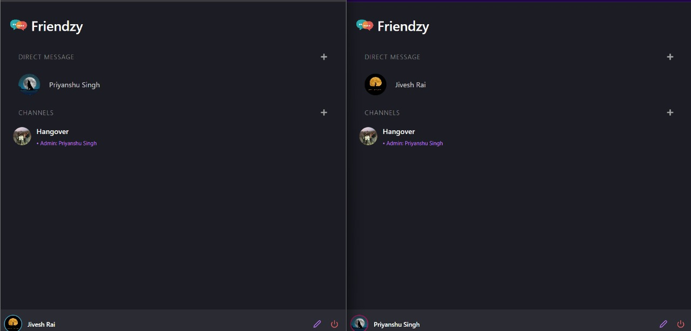

# Friendzy - Real-Time Chat Application

A modern, full-stack real-time chat application built with React, Node.js, Express, and Socket.IO. Friendzy allows users to engage in real-time messaging, create channels, and manage their profiles in a sleek, responsive interface.

## 📸 Screenshots

### Login Page


### Profile Creation


### Main Page


### Contact Details


### Channel Management


### Chat Interface
<div align="center">
  
  
</div>
<div align="center">
  
  
</div>
<div align="center">
  
</div>

## 🚀 Features

- ⚡ **Real-time messaging** with Socket.IO
- 🔐 **User authentication** with JWT tokens
- 💬 **Direct messaging** between users
- 📢 **Channel creation** and management
- 📎 **File sharing** and image uploads
- 👤 **Profile customization** with avatar support
- 📱 **Responsive design** with modern UI/UX
- 📜 **Message history** and persistence
- 🟢 **Online status** indicators
- 🎨 **Animated UI elements** with Lottie animations

## 🛠 Tech Stack

### Frontend
- **React 19** - UI framework
- **Vite** - Build tool and dev server
- **Tailwind CSS** - Utility-first CSS framework
- **Radix UI** - Accessible component primitives
- **Socket.IO Client** - Real-time communication
- **Axios** - HTTP client
- **Zustand** - State management
- **React Router** - Client-side routing
- **Lottie React** - Animations

### Backend
- **Node.js** - Runtime environment
- **Express.js** - Web framework
- **Socket.IO** - Real-time bidirectional communication
- **MongoDB** - Database
- **Mongoose** - MongoDB ODM
- **JWT** - Authentication
- **Bcrypt** - Password hashing
- **Multer** - File upload handling
- **CORS** - Cross-origin resource sharing

## 📁 Project Structure

```
Chat Application/
├── React_node_chat_app/          # Frontend React application
│   ├── src/
│   │   ├── components/           # Reusable UI components
│   │   ├── pages/               # Application pages
│   │   │   ├── auth/            # Authentication pages
│   │   │   ├── chat/            # Chat interface
│   │   │   └── profile/         # User profile
│   │   ├── store/               # State management
│   │   ├── lib/                 # Utility functions
│   │   ├── context/             # React contexts
│   │   └── assets/              # Static assets
│   ├── package.json
│   └── vite.config.js
├── server/                       # Backend Node.js application
│   ├── controllers/             # Route controllers
│   ├── models/                  # Database models
│   ├── routes/                  # API routes
│   ├── middlewares/             # Custom middlewares
│   ├── uploads/                 # File storage
│   ├── package.json
│   └── index.js
└── README.md
```

## 🚀 Getting Started

### Prerequisites
- Node.js (v16 or higher)
- MongoDB database
- npm or yarn package manager

### Installation

1. **Clone the repository**
   ```bash
   git clone <repository-url>
   cd "Chat Application"
   ```

2. **Install backend dependencies**
   ```bash
   cd server
   npm install
   ```

3. **Install frontend dependencies**
   ```bash
   cd ../React_node_chat_app
   npm install
   ```

4. **Environment Configuration**

   Create `.env` files in both `server/` and `React_node_chat_app/` directories:

   **Backend (server/.env)**
   ```env
   PORT=8747
   DATABASE_URL=your_mongodb_connection_string
   JWT_KEY=your_jwt_secret_key
   ORIGIN=http://localhost:5173
   NODE_ENV=development
   ```

   **Frontend (React_node_chat_app/.env)**
   ```env
   VITE_SERVER_URL=http://localhost:8747
   ```

5. **Start the development servers**

   **Terminal 1 - Backend server:**
   ```bash
   cd server
   npm run dev
   ```

   **Terminal 2 - Frontend application:**
   ```bash
   cd React_node_chat_app
   npm run dev
   ```

6. **Open your browser**
   
   Navigate to `http://localhost:5173` to access the application.

## 🎯 Usage

1. **Register/Login**: Create a new account or login with existing credentials
2. **Profile Setup**: Complete your profile with avatar and personal information
3. **Start Chatting**: 
   - Send direct messages to other users
   - Create or join channels for group conversations
   - Share files and images
   - View message history and online status

## 📡 API Endpoints

### Authentication
- `POST /api/auth/signup` - User registration
- `POST /api/auth/login` - User login
- `POST /api/auth/logout` - User logout
- `GET /api/auth/user-info` - Get current user info

### Messages
- `GET /api/messages/:userId` - Get messages with a user
- `POST /api/messages` - Send a message
- `POST /api/messages/upload-file` - Upload file

### Contacts
- `POST /api/contacts/search` - Search for contacts
- `GET /api/contacts/get-contacts-for-dm` - Get DM contacts
- `GET /api/contacts/get-all-contacts` - Get all contacts

### Channels
- `POST /api/channel/create-channel` - Create a new channel
- `GET /api/channel/get-user-channels` - Get user's channels
- `GET /api/channel/get-channel-messages/:channelId` - Get channel messages

## 🔄 Real-time Events

The application uses Socket.IO for real-time communication:

- `sendMessage` - Send a message to a user or channel
- `receiveMessage` - Receive a message in real-time
- `receiveChannelMessage` - Receive channel message
- Connection events for user presence tracking

## 🎨 UI Components

Built with modern, accessible components using:
- **Radix UI** for base components (Dialog, Tooltip, Avatar, etc.)
- **Tailwind CSS** for utility-first styling
- **Custom animations** with Lottie
- **Responsive design** for mobile and desktop
- **Dark theme** with modern color palette

## 🚀 Deployment

### Frontend (Vercel)
1. Build the frontend:
   ```bash
   cd React_node_chat_app
   npm run build
   ```
2. Deploy to Vercel or connect your GitHub repository
3. Set environment variables:
   - `VITE_SERVER_URL` - Your backend URL

### Backend (Render/Railway)
1. Deploy the `server` folder
2. Set environment variables:
   - `DATABASE_URL` - MongoDB connection string
   - `JWT_KEY` - JWT secret key
   - `ORIGIN` - Frontend URL (e.g., https://friendzy-app.vercel.app)
   - `PORT` - Port number (default: 8747)
   - `NODE_ENV` - Set to `production`

## 🔐 Security

- JWT-based authentication
- Password hashing with bcrypt
- CORS protection
- Input validation and sanitization
- Secure file upload handling

## 🤝 Contributing

Contributions are welcome! Please follow these steps:

1. Fork the repository
2. Create a feature branch: `git checkout -b feature/new-feature`
3. Commit your changes: `git commit -am 'Add new feature'`
4. Push to the branch: `git push origin feature/new-feature`
5. Submit a pull request

## 📄 License

This project is licensed under the MIT License - see the [LICENSE](LICENSE) file for details.

## 👨‍💻 Author

**PRIYANSHU SINGH**

## 🙏 Acknowledgments

- React team for the amazing framework
- Socket.IO for real-time communication capabilities
- Tailwind CSS for the utility-first approach
- Radix UI for accessible component primitives
- MongoDB team for the excellent database solution
- The open-source community for inspiration and tools

---

<div align="center">
  <strong>Friendzy</strong> - Where conversations come alive! 💬✨
  <br><br>
  Made with ❤️ by Priyanshu Singh
</div>
